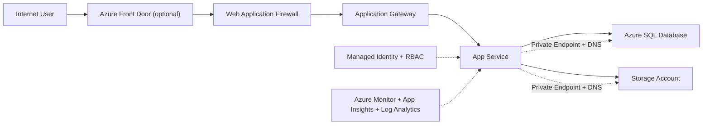
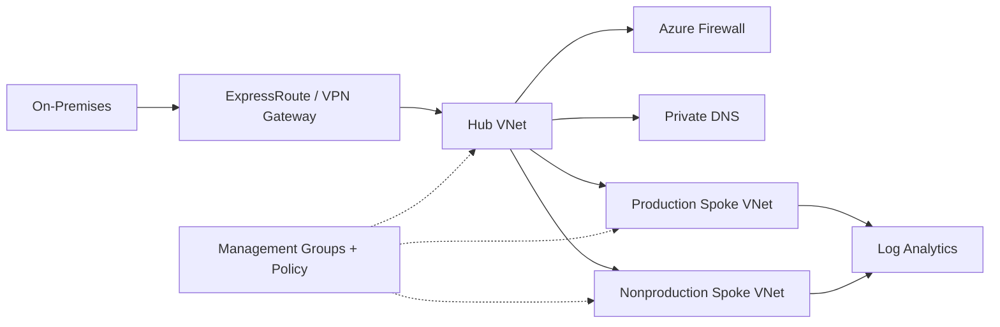
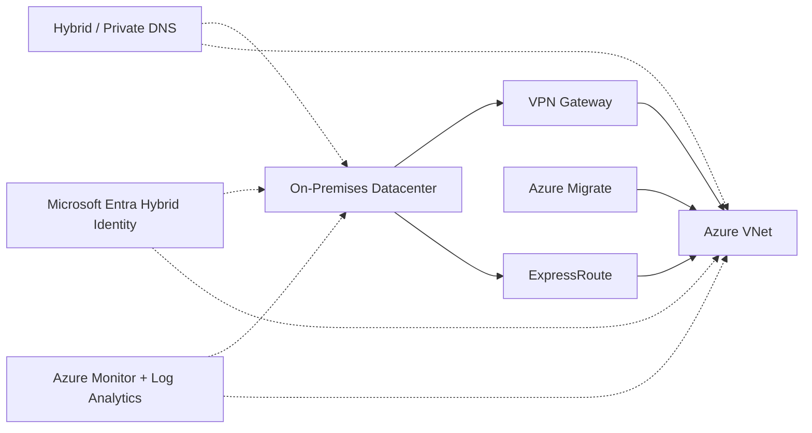
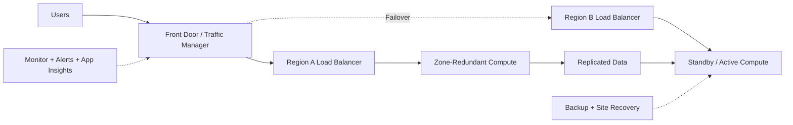
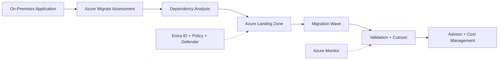

# Azure Digital Brain V2.0 – Architecture Scenarios

Stand: 11. August 2026  
Leitfrage: **Wie werden Azure-Komponenten in einer realen Unternehmensarchitektur zusammengesetzt und warum?**

## 1. Secure Web Application Architecture

### Ziel und Architekturübersicht

Eine moderne Webanwendung erhält einen kontrollierten HTTPS-Einstieg, private Datenpfade, identitätsbasierten Zugriff und End-to-End-Observability.

### Komponenten und Entscheidungen

- Front Door ist sinnvoll für globalen Entry Point und regionsübergreifendes Routing; eine rein regionale Anwendung kann direkt mit Application Gateway beginnen.
- WAF schützt HTTP/S auf Layer 7; DDoS Protection und Azure Firewall adressieren andere Netzwerk- und Egress-Risiken.
- App Service ist der PaaS-Standard. VMs bleiben eine Variante bei Betriebssystemanforderungen, AKS bei bewusstem Kubernetes-Plattformbetrieb.
- VNet, getrennte Subnets, NSGs, UDRs, Private Endpoints und Private DNS begrenzen erreichbare Pfade.
- Managed Identity ersetzt statische Credentials; Entra ID, RBAC und Least Privilege schützen Benutzer- und Managementzugriff.
- SQL Database und Storage werden vom Compute-Lifecycle entkoppelt und privat angebunden.

### Security, Monitoring, Reliability und Kosten

- Security: End-to-End-TLS, WAF, DDoS, kontrollierter Egress, Private Access, Policy, Defender und Verschlüsselung.
- Monitoring: Anwendung, Runtime und Plattform getrennt erfassen und über Korrelations-IDs, KQL und Alerts verbinden.
- Reliability: zonenredundanter Ingress und Compute, Health Checks, Datenredundanz, Backup und getesteter DR-Pfad.
- Kosten: Edge, WAF, Application Gateway, Firewall, Private Endpoints, Mindestinstanzen und Log-Ingestion bewusst budgetieren.

### Häufige Fehler

- Front Door, Application Gateway und Load Balancer ohne klare Aufgabe stapeln.
- Private Endpoint aktivieren, aber Public Access oder Private DNS falsch konfigurieren.
- Managed Identity mit überbreiten Rollen kombinieren.
- Nur Infrastrukturmetriken statt kritischer Nutzerflüsse beobachten.

### Enterprise-Beispiel und Betriebsmodell

Ein europaweites Kundenportal nutzt Front Door, WAF und Application Gateway vor einem zonenredundanten App Service. SQL und Storage sind nur privat erreichbar. Das Plattformteam betreibt Netz- und Monitoring-Baselines, das App-Team Code, Instrumentierung und SLO, Security Operations WAF und Defender.

**Merksatz:** Ein sicherer Webpfad verbindet kontrollierten Einstieg, private Abhängigkeiten, identitätsbasierten Zugriff und messbaren Betrieb.

---

## 2. Enterprise Hub-Spoke Architecture

### Ziel und Architekturübersicht

Ein zentraler Hub stellt Hybridkonnektivität, Firewall, DNS und Logging bereit; Spokes isolieren Workloads nach Umgebung, Team und Schutzbedarf.

### Komponenten und Entscheidungen

- Hub und Spokes sind Rollen vorhandener VNets; Peering verbindet sie nichttransitiv.
- UDRs lenken ausgewählten Traffic durch die zentrale Firewall; lokale NSGs bleiben für Workloadsegmentierung zuständig.
- ExpressRoute bietet private Enterprise-Konnektivität, VPN einen schnelleren oder ergänzenden Pfad.
- Private DNS muss Private Endpoints über Spokes und On-Premises konsistent auflösen.
- Management Groups und Policy integrieren Connectivity- und Workload-Subscriptions in ein gemeinsames Governance-Modell.
- Virtual WAN ist eine Alternative, wenn viele Regionen, Branches und Managed Routing wichtiger als vollständige Eigenkontrolle sind.

### Security, Monitoring, Reliability und Kosten

- Security kombiniert zentrale Inspection mit lokalen NSGs und klaren Trust Boundaries.
- Monitoring umfasst Gateway, Firewall, Peering, Routing, DNS, SNAT-Kapazität und Spoke-Telemetrie.
- Ein Hub ist regional; Multi-Region benötigt mehrere Hubs und einen geplanten Inter-Hub-Pfad.
- Firewall, Gateways, ExpressRoute, Log-Ingestion und Datentransfer sind wesentliche Plattformkosten.

### Häufige Fehler

- Peering als transitiv behandeln.
- Überlappende IP-Adressräume verwenden.
- UDRs ohne Rückweg und asymmetrisches Routing entwerfen.
- Zentrale Loggingkosten ohne Retention und Ownership sammeln.

### Enterprise-Beispiel und Betriebsmodell

Ein Konzern betreibt pro Region einen Connectivity-Hub mit ExpressRoute, VPN-Backup, Azure Firewall und Private DNS. Plattformteams verantworten den Hub, Workloadteams ihre Spokes und lokale NSGs, Security die zentralen Baselines.

**Merksatz:** Der Hub zentralisiert gemeinsame Kontrolle; Spokes bewahren Workload-Isolation und Verantwortung.

---

## 3. Hybrid Cloud Architecture

### Ziel und Architekturübersicht

On-Premises und Azure werden während einer Migration oder dauerhaft über Netzwerk, DNS, Identität, Security und Betrieb verbunden.

### Architekturentscheidungen

- VPN ist schnell verfügbar und verschlüsselt, ExpressRoute privat und planbarer; kritische Unternehmen kombinieren bewusst getrennte Pfade.
- Hybrid DNS benötigt Forwarding und kontrollierte Autorität für private Azure-Zonen.
- Die Hybrid-Identity-Methode entscheidet, ob Cloudauthentifizierung von lokalen Komponenten abhängt.
- Azure Migrate gruppiert Server über Discovery und Dependency Analysis in belastbare Migrationswaves.
- Jeder Hybridbaustein braucht Zielzustand, Owner und gegebenenfalls Exit-Kriterium.

### Security, Monitoring, Reliability und Kosten

- Eine Hybridverbindung ist kein implizit vertrauenswürdiges LAN; Segmentierung und Identity bleiben erforderlich.
- Gateway, Routing, DNS, Identity-Synchronisation und End-to-End-Workload-Health gemeinsam überwachen.
- Provider, Circuit, Gateway, DNS und lokale Identity sind getrennte Fehlerdomänen.
- ExpressRoute, Parallelbetrieb, doppelte Werkzeuge und Datenübertragung erhöhen Kosten.

### Häufige Fehler

- Adressüberschneidungen erst während der Migration entdecken.
- Private Endpoints ohne hybrides DNS-Konzept einführen.
- Cloudzugriff unnötig von einem einzelnen lokalen Identity-Dienst abhängig machen.
- abhängige Komponenten getrennt migrieren.

### Enterprise-Beispiel und Betriebsmodell

Ein Produktionsunternehmen verbindet Werke zunächst per VPN und später per ExpressRoute mit Azure. Identity-, Netzwerk- und Migrationsteams betreiben definierte Teilbereiche; gemeinsame Logs und synthetische Tests verbinden die Incident Response.

**Merksatz:** Hybrid ist ein bewusst betriebenes Zusammenspiel zweier Umgebungen, kein dauerhaftes Provisorium ohne Zielbild.

---

## 4. Highly Available Application Architecture

### Ziel und Architekturübersicht

Die Anwendung toleriert lokale Komponentenfehler über Zonen und besitzt für schwere oder regionale Ereignisse einen getrennten DR-Pfad.

### Architekturentscheidungen

- Availability Zones schützen innerhalb einer Region; Multi-Region adressiert regionale Fehler, erhöht aber Daten- und Betriebsaufwand.
- Active/Active, Active/Passive und Restore unterscheiden sich bei RTO, RPO, Kosten und Konsistenz.
- Autoscale passt Lastkapazität an, ersetzt aber keine sofortige Fehlerreserve.
- Automatischer Failover ist nur bei eindeutigen Signalen und sicherem Zielzustand sinnvoll.
- Region Pairs liefern Kontext, aber keinen automatischen DR-Mechanismus für jede Anwendung.

### HA versus DR

- High Availability hält erwartete lokale Fehler durch Redundanz und Umleitung aus.
- Disaster Recovery stellt nach schweren Ereignissen durch Restore, Replikation oder Regionsfailover wieder her.
- RPO begrenzt tolerierbaren Datenverlust, RTO die Wiederanlaufzeit.

### Häufige Fehler

- HA und DR gleichsetzen.
- Autoscale als sofortige Reserve interpretieren.
- nur Failover, aber nicht Restore, Failback, DNS und Identität testen.
- Plattform-SLA statt eines End-to-End-SLO verwenden.

### Enterprise-Beispiel und Betriebsmodell

Ein B2B-Portal läuft zonenredundant und besitzt eine Warm-Standby-Region. Business Owner definieren SLO, RPO und RTO; Plattform- und App-Team testen quartalsweise Restore, Failover und Failback.

**Merksatz:** HA hält lokale Fehler aus; DR stellt nach schweren Ausfällen wieder her – beide brauchen messbare Ziele und Tests.

---

## 5. Cloud Migration Architecture

### Ziel und Architekturübersicht

Eine bestehende Anwendung wird nicht serverweise verschoben, sondern nach Abhängigkeiten bewertet, in einer vorbereiteten Landing Zone migriert, validiert und optimiert.

### Phasen und Entscheidungen

1. Plan: Inventar, Abhängigkeiten, Baseline, Business Case und Erfolgskriterien.
2. Prepare: Landing Zone, Netzwerk, Identity, Policy, Security und Monitoring.
3. Execute: Rehost, Replatform oder Modernisierung in abhängigen Waves.
4. Evaluate: Funktion, Performance, Security, Kosten und SLO gegen die Baseline prüfen.
5. Decommission und Improve: Quelle kontrolliert abschalten, Rightsizing und Optimierung.

Rehost ist schneller, konserviert aber Betriebsaufwand. PaaS reduziert Plattformverantwortung, verlangt häufig Anwendungsänderungen. Tiefe Modernisierung sollte Geschäftswert liefern und nicht jede Migration blockieren.

### Häufige Fehler

- Serverliste statt Anwendungsmodell migrieren.
- Landing Zone nach den ersten Workloads bauen.
- Security und Monitoring auf später verschieben.
- die Quelle ohne bestätigten Restore-, Rollback- und Abnahmeprozess abschalten.

### Enterprise-Beispiel und Betriebsmodell

Ein Versicherer gruppiert 400 Server per Dependency Analysis und migriert priorisierte Waves in eine policy-gesteuerte Landing Zone. Jede Wave besitzt Business Owner, Cutover-Runbook, Telemetrievergleich und Decommission-Datum.

**Merksatz:** Erst verstehen und vorbereiten, dann in Abhängigkeiten migrieren, messen und gezielt optimieren.

## Quellen

Die Szenarien verwenden bestehende Microsoft-Quellen der V1.8-Wissensbasis sowie neun neue offizielle Referenzen aus Azure Architecture Center, Cloud Adoption Framework, Azure Migrate und Microsoft Entra. Die vollständige maschinenlesbare Zuordnung steht in `data/canonical/scenarios.json`.
